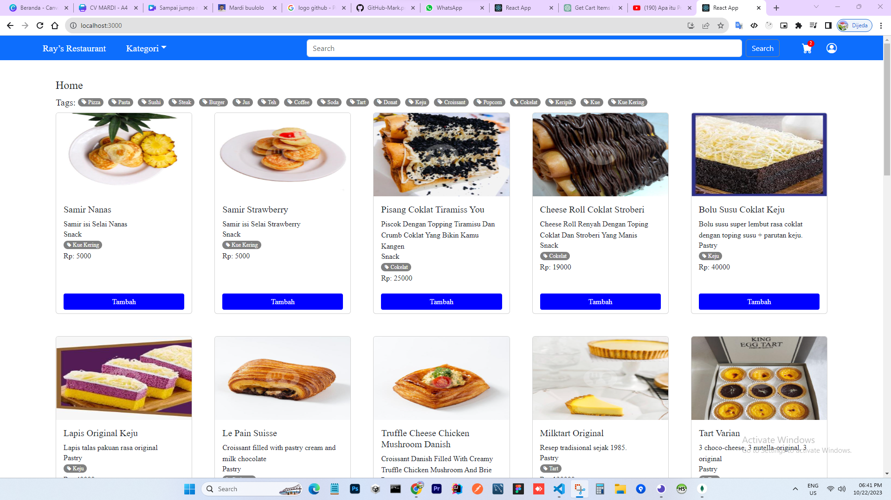
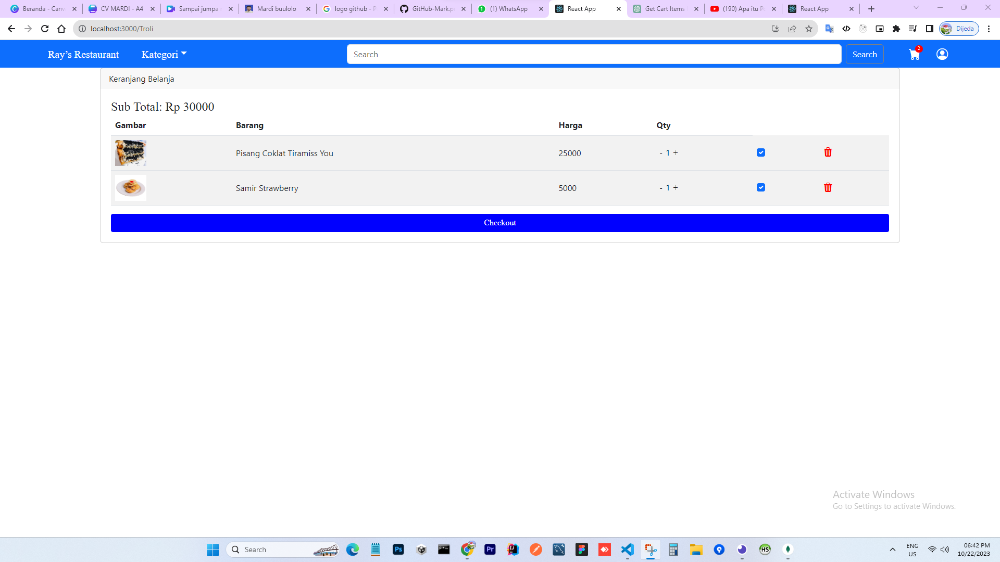
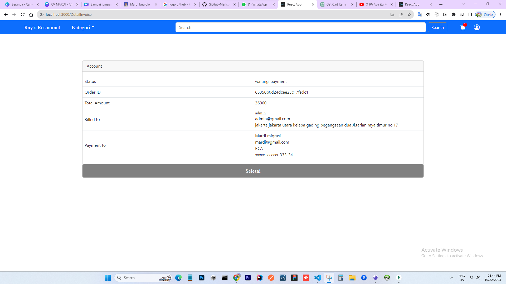

## [Shopefood](https://github.com/mardibll/Shopefood.git)

The Shopefood application is an application designed simply for users, the aim is to make it easier for users to order food online. so buyers can order food quickly without spending a lot of time.

### Features
```sh
- List
- Detail
- Search
- Filter
```

### Skills Used
```sh
- React-Js
- Redux
- Redux-Saga
- Axios
- Rest Api
```

<p align="center">
     
     
    
     
</p>
